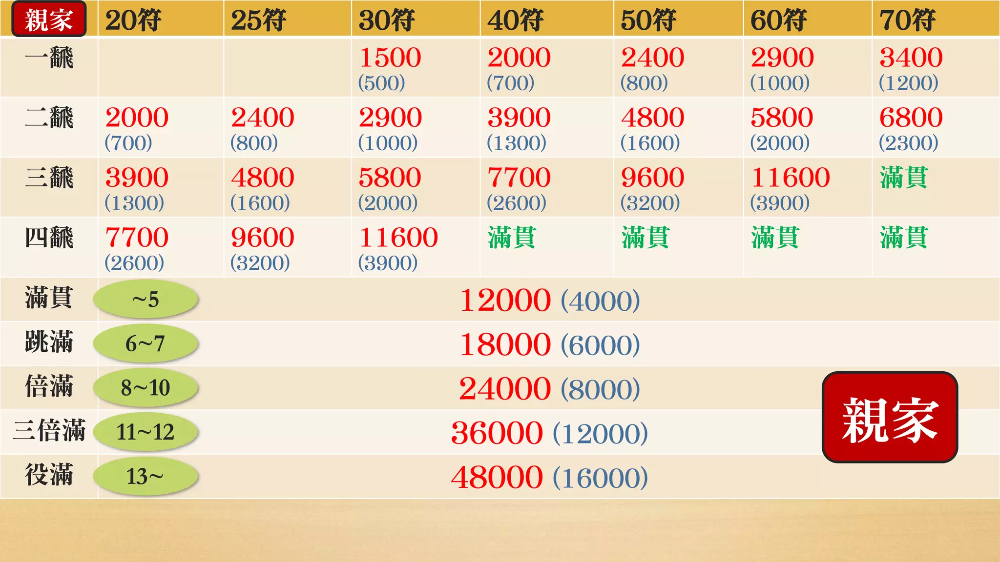

日麻 -- 立直麻将
===================================

日麻是一个比分数排名的游戏，通常每人25000分的点棒作为筹码。

分数主要是由 **番** 和 **符** 决定。

通常使用34种共136张牌（没有春夏秋冬和梅兰竹菊）

准备
----------
1. 决定坐位

    抽牌，抽到好牌选坐位。

2. 分点棒

    1根10000点、2根5000点、4根1000点、10根100点。

3. 堆牌

    一人一排山，17墩牌。山围起来的中间叫做河。

4. 决定 第一局的亲（起）、子家（庄家、闲家）

    最先选坐位的一家掷骰子，掷到的人再掷骰子，再掷到的人为起家。也就是东1局的亲家（东、庄）。此人一般拿一个场风板放右手边标识一下。

    其他人按逆时针称为 南家 西家 北家。

    随着牌局进行轮流做亲家（东）。

    骰子点数tips：

    奇数：对家、自家

	3、7、11 对家

	5、9 自家

    偶数：下家、上家

	2、6、10 下家

	4、8、12 上家

开打
----------

1. 亲家掷骰子决定从哪家排山抓牌，排山那家掷骰子决定跳过多少墩牌开始抓。

2. 抓牌

3. 开悬赏指示牌 -- 王牌（最后7墩牌）倒数第三墩上边的牌掀出来，这个牌的下一张牌是dora牌（宝牌）

4. 打

5. 和  或者  流局。

    普通流局（没人和）

    途中流局：四风连打；四杠散了；九种九牌；四家立直

算分
----------

.. image:: pictures/点数公式.jpg
	   

.. image:: pictures/点数公式2.jpg

各家需缴纳的分数
-----------------------

.. image:: pictures/子家表.jpg
	   

.. note::

   这个是个note。

具体
--------

.. toctree::
   :maxdepth: 2

   fan
   fu
